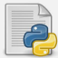

# Hello everyone! I'm Dogan Yigit.👋 

I'm an enthusiast of **data science, data visualization, machine/deep learning, computer vision, web programming (especially backend)**, and **artificial intelligence (AI)**. Though it's a long journey to master everything thoroughly, I'm still eager to read, code and learn new things as much as I can every day.

### What have I've accomplished so far in recent years

* **Softwares:** Nearest neighbor simulations for proximity queries on two-dimensional surface _(more different types will be uploaded here in the future)_
* **Data Science:** Data exploration (EDA) on selected datasets; feature engineering, data manipulation, wrangling, cleaning, visualization for gaining many insights.
* **Machine Learning:** Train many different classification and regression models and used them to predict values (e.g. yearly salaries based on the personal attributes), later measured their performance & accuracy w.r.t. well-known metrics.
* **Explainable AI:** Attempting to interrept (AI) models' execution steps with the tools that enable the explanation, such as LIME & SHAP.
* **Image Processing:** Image manipulations, object tracking, human pose estimation, gesture recognition _(such repos will be uploaded here in the future)_
* **Web Programming:** Understanding how frontend/backend sides are working together in a modern web application. Mostly focused on **backend** side, uitlizing Natural Language Processing (NLP) in the most efficient way, also machine learning models when necessary. Furthermore, retrieving data accurately from database system with somewhat complex queries. Furthermore, this includes Python projects _(Django)_ for different development experiences.

Recently, my focus is shifting into _Artificial Intelligence (AI)_ technologies. Hopefully, I'll be able to build my own AI-powered projects, with **RAGs, MCPs, agents, n8n**; whatever possible.

_With my programming experience for over a decade, I'm planning to present my projects here with passion!_

<!--
In the branch of Computer Science, I'm heavily interested in **Data Science**. In today's world, vast amount of data is being produced every day in digital environment and in the meantime, analyses should be performed in order to reveal valuable knowledge. Furthermore, the most optimal time and space complexities for the methods are necessary for fulfilling the needs efficiently; that's why, it is vital to get the hang of the state-of-the-art techniques, especially to conquer **Big Data**.

With this motivation, I aimed for becoming a veteran _Data Scientist_ in a long period. For this purpose, I've taken several online courses, obtained certificates and still proceeding to add things to my toolbox. To consolidate them further, I've been making analyses based on real-life data from time to time. Thankfully, GitHub has enabled me to present my works all around the world. Of course, I'd like to push forward and get even better in the future!

Besides, **Image Processing** is another branch I've worked on since 2021. Thus, I'm getting my hands on these methods for some fascinating topics, such as image manipulations, object tracking, human pose estimation and gesture recognition.

For nearly 1 year, I'm headed for **web programming** to understand how the frontend/backend sides are working together in a modern web application. Nonetheless, my focus point is on **the backend side** to run methods related to **Natural Language Processing (NLP)** efficiently and optimally when requests are received.

_Of course, this will not be limited to just aforementioned topics above! Besides, with my programming experience for over a decade, I'm planning to present other projects I carried out with passion as individual repos..._
-->

  

### Prog. Languages

   
   
 

### IDEs

  
  
  

### Libraries & Frameworks

   
  
  

<!--
**toUpperCase78/toUpperCase78** is a ✨ _special_ ✨ repository because its `README.md` (this file) appears on your GitHub profile.

Here are some ideas to get you started:

- 🔭 I’m currently working on ...
- 🌱 I’m currently learning ...
- 👯 I’m looking to collaborate on ...
- 🤔 I’m looking for help with ...
- 💬 Ask me about ...
- 📫 How to reach me: ...
- 😄 Pronouns: ...
- ⚡ Fun fact: ...
-->
